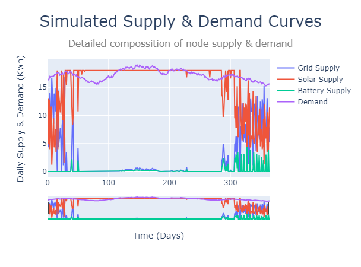

# Peer-to-Peer Energy Exchange
### Hack from Home 2021, Hosted by [DataSwyft](https://www.dataswyft.io/)

     

## P2P Energy Exchange

> [!NOTE]
> This project concluded with the P2P-Eex Team winning the "Best Pitch" award, validating the uniqueness and commercial potential of such a project.

The P2P Energy Exchange is aiming to revolutionize and democratize energy markets. Our innovative platform integrates individual nodes (households, producers, buildings or, regions) into a decentralized energy market. To deploy our decentralization system, we are offering automated intra-node energy flow optimization. This demo is a proof of concept for this said optimization. We use proprietary algorithms to best allocate energy resources within a given context. 

**Read more on our website:** https://hackathon-from-sfsdf.vercel.app/

## Table of Contents

* [P2P Energy Exchange](#p2p-energy-exchange)
* [Proof of Concept](#proof-of-concept)
  * [Data & Citations](#data--citations)
* [Requirements](#requirements)
* [Reference](#reference)
  * [Setup Files](#setup-files)
    * [panels.json](#panelsjson)
    * [params.json](#paramsjson)
  * [helpers.py](#helperspy)
    * [random_noise](#random_noise)
    * [get_data](#get_data)
  * [algo.py](#algopy)
    * [calc_algo_results](#calc_algo_results)
  * [reporter.py](#reporterpy)
    * [reporter](#reporter)
* [Acknowledgements](#acknowledgements)

## Proof of Concept

In our Proof of Concept (POC) scenario,
we examine a hypothetical green development project located in Amsterdam and comprising four homes.
This POC is grounded in the needs and developments in the housing sector in Northern Europe and comprises a valid test case.
As such, we are simulating a complex of four (4) homes located in Amsterdam and equipped with:
* **Solar Panels:** 72 250W panels ($115m^{2}$) @ 15% efficiency (18Kwh max per day)
* **Battery Pack:** 43Kwh w. 70% discharge limit and max 2Kwh daily charging rate.
* **Grid Connection:** Stable grid connection at the same price as what the solar power can be sold for.

 

### Data & Citations

* **Solar Irradiance Data:** provided via [NASA Power API for Prediction of Worldwide Energy Resources](https://power.larc.nasa.gov/).
* **Placeholder Solar Panel Data:** provided via [Greenmatch.co.uk](https://www.greenmatch.co.uk/blog/how-many-solar-panels-do-i-need-v2).
* **[The flexible prosumer: Measuring the willingness to co-create distributed flexibility, Kubli et. al., 2018.](https://doi.org/10.1016/j.enpol.2017.12.044)**
* **[Time Series and Renewable Energy Forecasting. Time Series Analysis and Applications, Ghofrani et. al., 2018.](http://10.0.22.140/intechopen.70845)**

## Requirements
* [numpy](https://numpy.org/)
* [pandas](https://pandas.pydata.org/)
* [datapane](https://docs.datapane.com/)
* [plotly](https://plotly.com/)

## Reference

---------------------

### Setup Files

#### `params.json`

The `params.json` file which is specified as a parameter for the [`calc_algo_results()`](#calc_algo_results) function, contains all the necessary
inputs for the model in a user-friendly `.json` file. 

    {   "price" : <- Characteristics of the Electricity Price Timeseries
        {
            "mu" :0.00002, <- Generator mu
            "sigma" :0.0003, <- Generator sigma
            "start" :0.1437 <- Starting value
        },
        "demand" : { <- Characteristsics of the Energy Demand Timeseries
            "mu" : 0.00006, <- Generator mu
            "sigma" : 0.008, <- Generator sigma
            "start" : 16  <- Starting value (4Kw * 4 houses = 16)
        },
        "test_case" : { <- Test case characteristics
            "num_solar" : 72, <- Number of solar panels
            "battery_capacity" : 42 <- Battery capacity in Kwh
        },
    
        "algo" : { <- Algorithm parameters
            "random_seed" : 0,  <- Seed
            "rolling_window" : 15, <- Pricing rolling window for SMA
            "critical_limiter" : 0.7, <- Battery Discharge Limit
            "battery_start" : 0, <- Battery Starting Value
            "defecit_fill_grid" : 0.6, <- Share of Defecit Energy Requested via Grid (60%)
            "defecit_fill_battery" : 0.4, <- Share of Defecit Energy Requested via Battery (40%)
            "battery_refil_price_multiple" : 1.15, <- Multiple of energy to buy from grid when energy is cheap
            "battery_refil_multiple" : 0.2, <- Multiple at which energy can be added to the battery
            "daily_battery_charge" : 1 <- Daily 'safety' recharge of battery from grid when below limiter
        },
    
        "datapane" : { <- specifications for the datapane report, leave as is
            "token" : "placeholder",
            "name" : "placeholder"
        }
    }

#### `panels.json`

The `panels.json` file which is specified as a parameter for the [`calc_algo_results()`](#calc_algo_results) function,
contains the information to use for calculating the energy output of the panels. In our case, we are looking at the
"small panel" with 250W @ 15% ef. 

    { 
        "small panel" : 
        {
            "Wattage": 250,
            "Area" : 1.6,
            "Efficiency": 0.15,
            "Price" : 300
        },
        
        "medium panel" :
        {
            "Wattage" : 300,
            "Area" : 1.67,
            "Efficiency" : 0.16,
            "Price" : 320
        },
    
        "large panel" :
        {
            "Wattage" : 350,
            "Area" : 1.9,
            "Efficiency" : 0.17,
            "Price" : 400
        }
    }

### `helpers.py`

The `helpers.py` file contains two helpful functions which make data retrival and the creation of random timeseries
for the simulator simple.

#### `random_noise()`
The `random_noise()` function is heavily used in the [`calc_algo_results()`](#calc_algo_results) function
to create randomized timeseries based on inputs specified in [`panels.json`](#panelsjson).
The function returns an array of the random timeseries generated. 

**Returns:** `numpy.array` object.

    random_noise(mu : float, sigma : float, start_price : float)

**Example call:**

    random_noise(0.00002, 0.0003, 0.1437)

#### `get_data()`
The `get_data()` function is used in the source code to open the files necessary for the model to run and returns them
as objects (dataframes & dictionaries). 
Specifically, it opens [`params.json`](#paramsjson), [`panels.json`](#panelsjson) and, `solar_data_AMS.csv`, at specified in the parameters of
[`calc_algo_results`](#calc_algo_results). 

**Returns:** array of form [daily_data : `pd.Dataframe`, solar : `dict`, params : `dict`]

    get_data(csv_filename, json_filename, params_filename)

**Example call:**

    get_data('solar_data_AMS.csv', 'panels.json', 'params.json')

### `algo.py`
The `algo.py` file contains a single function and acts as the core of the simulator.

#### `calc_algo_results()`
The `calc_algo_results()` function goes over the input files as retried from [`get_data()`](#get_data) and uses the specifications
and data to create a simulation of the energy system.

**Returns:** data_frame : `pd.Dataframe`

    calc_algo_results(solar_data='solar_data_AMS.csv', panel_data='panels.json', setup_file='params.json')

**Example call:**

    calc_algo_results('solar_data_AMS.csv', 'panels.json', 'params.json')

### `reporter.py`

The `reporter.py` file contains the [`reporter()`](#reporter) function which exports the simulation report in .pdf format
as created using Datapane.

### `reporter()`
The `reporter()` function exports the simulation report in .pdf format
as created using Datapane.

**Returns:** True -- Exports `.pdf` file. 

    reporter(data_frame, filename='report.html')

**Example call:**

    reporter(calc_algo_results(a, b, c), 'myreport.html')

## Acknowledgements

This simulation was produced for Hack from Home 2021,
organized by Dataswyft, using Python 3.8 on Datalore and Visual Studio Code.
This report was generated using Datapane.

Website Development & Pitch Deck by: @biomathcode

Technical Consulting & Code QA by: Taoheed Abdulraheem

Brand Identity Development by: Jan Lewis

Source code & Pitch Deck (+presentation thereof) by: @fivosd